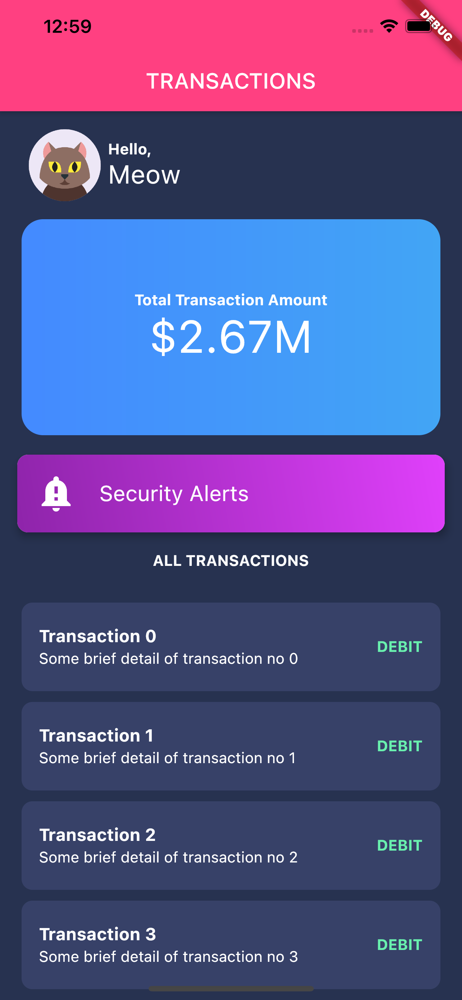

# transactions_page

Ref.:  

Bank App UI design flutter | Speed Code  
Youtube: <https://www.youtube.com/watch?v=bCSHLD7TsLA>  
Github: <https://github.com/themaaz32/bank_app>  

Card class: <https://api.flutter.dev/flutter/material/Card-class.html>  

Inkwell not showing ripple when used with Container decoration: <https://stackoverflow.com/a/57866878/5307753>

Add border Radius in the Inkwell widget in flutter: <https://stackoverflow.com/q/64410618/5307753>  

A new Flutter project.

## Getting Started

This project is a starting point for a Flutter application.

A few resources to get you started if this is your first Flutter project:

- [Lab: Write your first Flutter app](https://flutter.dev/docs/get-started/codelab)
- [Cookbook: Useful Flutter samples](https://flutter.dev/docs/cookbook)

For help getting started with Flutter, view our
[online documentation](https://flutter.dev/docs), which offers tutorials,
samples, guidance on mobile development, and a full API reference.
